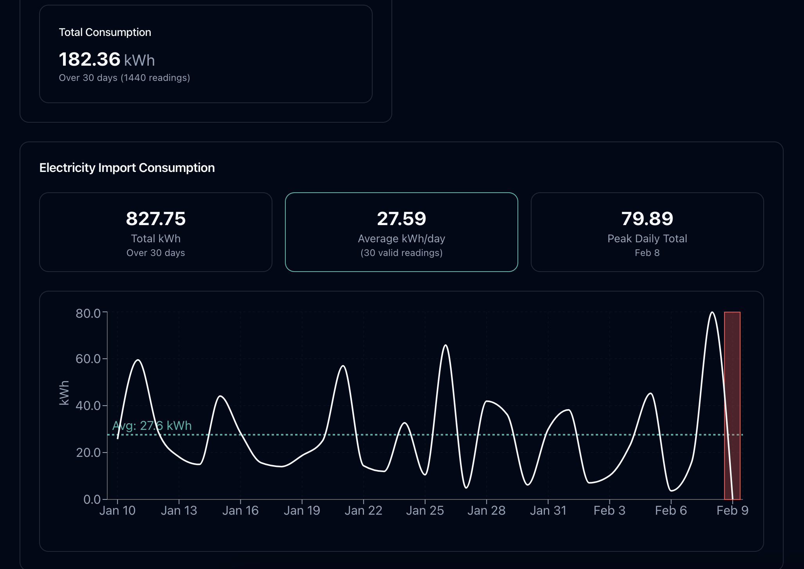

# 🐙 Octopus Energy Dashboard

A modern, real-time energy consumption dashboard for Octopus Energy customers. Monitor your electricity and gas usage with beautiful visualizations and insightful analytics.



## ✨ Features

- **Real-time Consumption Monitoring**
  - View electricity import/export data
  - Track gas consumption
  - Beautiful line charts with consumption patterns

- **Daily Pattern Analysis**
  - Identify peak and off-peak usage times
  - Hourly consumption breakdown
  - Highlight high and low usage periods

- **Smart Statistics**
  - Average daily consumption
  - Peak usage tracking
  - Cost estimations based on current tariffs

- **Modern UI/UX**
  - Clean, responsive design
  - Dark mode by default
  - Interactive charts and tooltips
  - Smooth animations and transitions

## 🚀 Getting Started

### Prerequisites

- Node.js (v16 or higher)
- npm or yarn
- An Octopus Energy account with API access

### Installation

1. Clone the repository:
```bash
git clone https://github.com/yourusername/octopus-energy-dashboard.git
cd octopus-energy-dashboard
```

2. Install dependencies:
```bash
npm install
# or
yarn install
```

3. Create a `.env` file in the root directory:
```env
VITE_OCTOPUS_API_KEY=your_api_key_here
VITE_OCTOPUS_API_ENDPOINT=https://api.octopus.energy/v1
```

4. Start the development server:
```bash
npm run dev
# or
yarn dev
```

## 🛠️ Built With

- [React](https://reactjs.org/) - UI Framework
- [TypeScript](https://www.typescriptlang.org/) - Type Safety
- [Vite](https://vitejs.dev/) - Build Tool
- [Recharts](https://recharts.org/) - Charting Library
- [TailwindCSS](https://tailwindcss.com/) - Styling
- [date-fns](https://date-fns.org/) - Date Manipulation
- [Radix UI](https://www.radix-ui.com/) - UI Components

## 📊 Features in Detail

### Consumption Chart
- Line chart showing energy usage over time
- Red zones indicating missing data periods
- Average consumption reference line
- Interactive tooltips with detailed consumption data

### Daily Pattern Chart
- Bar chart showing hourly consumption patterns
- Color-coded bars for peak and lowest usage times
- Detailed statistics for each hour
- Number of readings and consumption values

### Statistics Cards
- Total consumption overview
- Average daily usage
- Peak consumption periods
- Cost estimations

## 🔒 Security

The dashboard uses environment variables for sensitive data. Never commit your `.env` file or expose your API keys.

## 🤝 Contributing

Contributions are welcome! Please feel free to submit a Pull Request.

## 📝 License

This project is licensed under the MIT License - see the [LICENSE](LICENSE) file for details.

## 🙏 Acknowledgments

- [Octopus Energy API](https://developer.octopus.energy/docs/api/) for providing the data
- The open-source community for the amazing tools
- All contributors who help improve this dashboard 